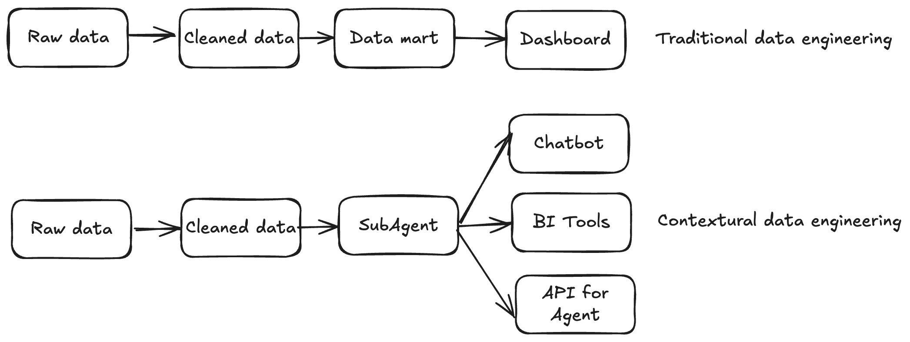
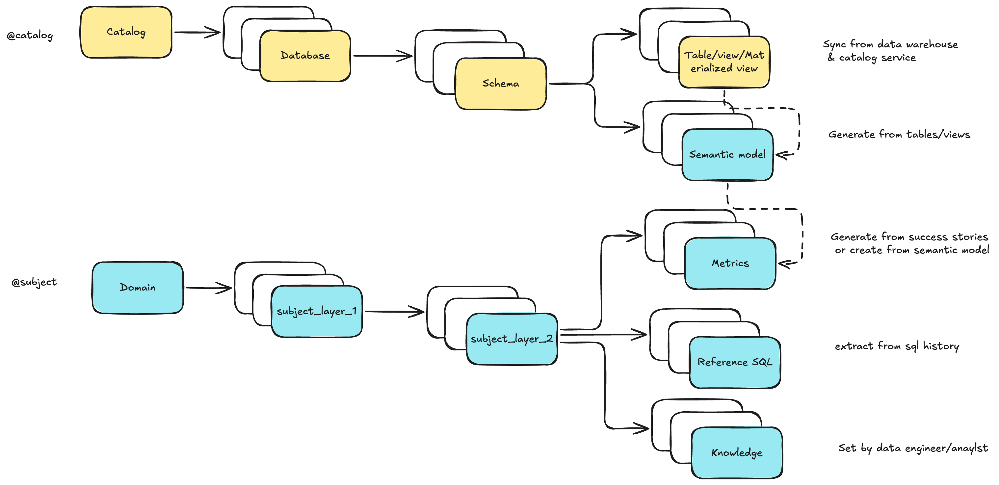
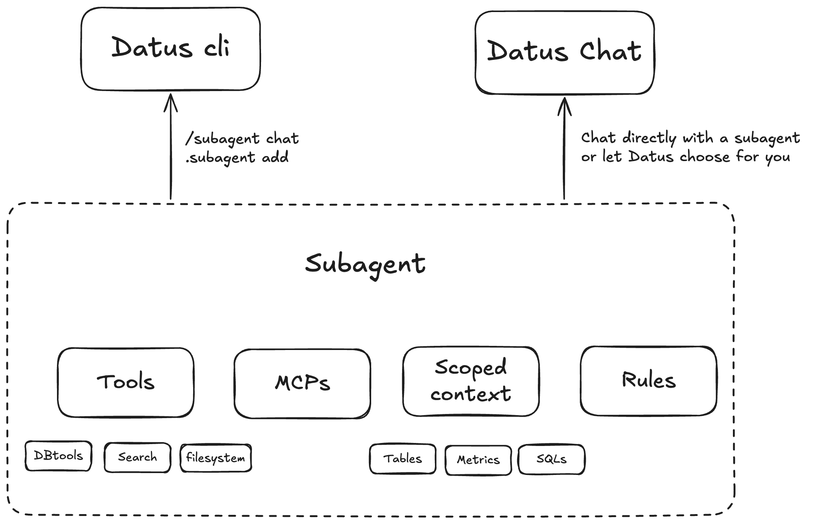
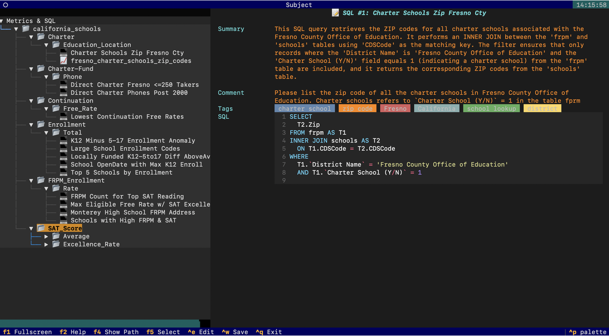
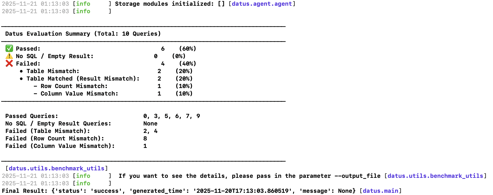
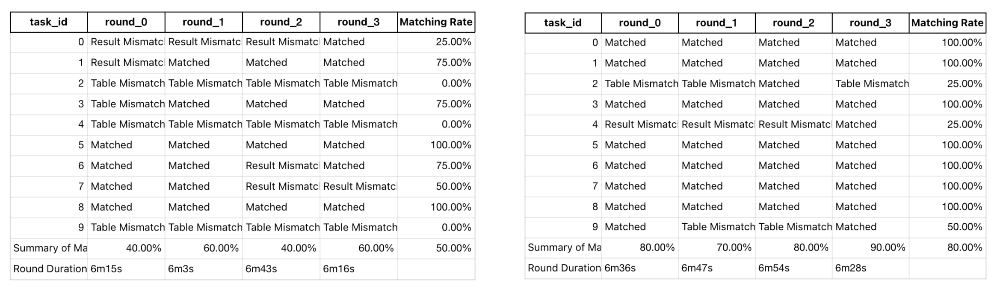

# Contextual Data Engineering: Concepts & Hands-on Tutorial

This page is split into two halves. **Part 1** explains the concepts behind Contextual Data Engineering — what it is, why it matters, and how Datus models long-term data context. **Part 2** is a step-by-step walkthrough that puts those concepts into practice with the bundled California Schools dataset, using the `/bootstrap` REPL flow that you will use every day in your own projects.

If you have ten minutes, skip the prose and jump to [Part 2 — Hands-on Tutorial](#part-2--hands-on-tutorial-california-schools).

---

## Part 1 — Concepts

### What's Contextual Data Engineering

**Contextual Data Engineering** is a new paradigm that transforms how data systems are built, maintained, and used in the age of AI. Instead of delivering static tables and pipelines, it focuses on **building evolvable context** — a living, intelligent layer for data that integrates metadata, referenced SQLs, semantic models, and metrics into a unified system that both humans and AI agents can understand.



- **In traditional data engineering**, pipelines end with data delivery.
- **In contextual data engineering**, the pipeline itself becomes **a knowledge graph of your data system**, continuously learning from historical SQL, feedback loops, and human corrections.

It is not just about *moving data and build tables* — it's about *understanding and evolving* the context around the data.


### Why It Matters

**LLMs hallucinate without context**

Data context is a vast and complex space. We need data engineers — the ones who know the data best — to build reusable, AI-ready contexts that ground every query and response.

**Static tables don't scale for dynamic needs**

Modern business questions change daily. Ad-hoc data fetch requests consume half of a data engineer's time, but the knowledge behind those queries is rarely captured or reused.

**Traditional data engineering is not evolvable**

The focus has long been on the data consumer side (analytics and dashboards), not the producer side where context and accuracy are built. Contextual data engineering shifts that focus — empowering engineers to produce *living context* rather than static artifacts.

### Why Datus

**Automatic Context Capture**

Datus automatically captures, stores, and recalls historical SQL, table structures, metrics, and semantic layers on demand — turning every interaction into long-term knowledge.

**Enhanced Long-term Memory**

Dual recall mechanisms (Tree + Vector) allow the system to remember not just exact matches, but semantically related queries and patterns — forming a continuously growing "context graph" for your data.

**Evolving Context Engineering**

The system learns from both machine generation and human feedback, incrementally refining its context over time. Every correction, benchmark, or success story becomes part of a self-improving data memory.

### Core Concepts

#### Long-Term Memory

We model **Data Engineering Context (Long-Term Memory)** as **two trees**:



- In [Datus CLI](../cli/introduction.md), you can browse and edit them via `/catalog` and `/subject`
- Use the `/bootstrap` slash command to batch-initialize and cold-start the knowledge base
- With subagents, you can define a **scoped context** — a curated subset of the global store that enables precise, domain-aware delivery

#### Interactive Context Building

**Co-authored context**

LLMs draft semantic models and metrics from tables and reference SQL, while engineers refine labels, metadata, and the subject tree.

**Command-driven iteration**

Commands like `/gen_semantic_model`, `/gen_metrics`, and `/gen_sql_summary` create and update assets. The `/catalog` and `/subject` screens support in-place edits.

**Feedback drives continuous improvement**

Exploration with `/chat`, success-story writebacks, and issue/benchmark loops convert usage into durable, reusable knowledge.

#### Subagent System



**Scoped, domain-aware subagents**

Package description, rules, and scoped context to unify tables, SQL patterns, metrics, and constraints for specific business scenarios.

**Configurable tools and MCPs**

Configure tools per scenario. Built-ins include DB tools, context-search tools, and filesystem tools. Enable and compose as needed.

**RL-ready architecture**

The subagent's scoped context forms an ideal RL environment (environment + question + SQL) for continuous training and evaluation.

#### Tools and Components

**Datus CLI**

An interactive [CLI for data engineers](../cli/introduction.md) with context-aware compression and search tools. Provides three "magic commands":

- `/` to chat and orchestrate
- `@` to view and recall context
- `!` to execute node/tool actions

**Datus Agent**

A [benchmarking and bootstrap utility](../benchmark/benchmark_manual.md) — the batch companion to the CLI. Used to:

- Build initial context from historical data
- Run benchmarks and evaluations
- Expose corresponding APIs

**Datus Chat**

A lightweight web chatbot for analysts and business users, supporting:

- Multi-turn conversations
- Built-in feedback (upvotes, issue reports, success stories)


---

## Part 2 — Hands-on Tutorial: California Schools

This walkthrough takes you through the same five outcomes the concepts above describe — building a knowledge base, packaging two subagents, and benchmarking baseline vs. context-rich answers — but you drive every step yourself. By the end you will have:

1. A populated [knowledge base](../knowledge_base/introduction.md) ([metadata](../knowledge_base/metadata.md) / [metrics](../knowledge_base/metrics.md) / [reference SQL](../knowledge_base/reference_sql.md))
2. Two [subagents](../subagent/introduction.md) (`datus_schools` and `datus_schools_context`) with different toolsets
3. A baseline benchmark result and a context-rich one to compare
4. A multi-round evaluation that demonstrates how context evolution improves SQL accuracy

Reading time ≈ 5 minutes; total runtime ≈ 15 minutes (the LLM-driven bootstrap steps are the slow part).

### Prerequisites

You need:

- `datus` installed (see the [Quick Start Guide](Quickstart.md))
- An LLM provider configured via `/model` inside `datus`. The picker writes provider credentials into `~/.datus/conf/agent.yml`.
- The MetricFlow semantic-layer adapter configured via `/services semantic` — the CLI will auto-install the missing `datus-semantic-metricflow` package when the service configuration is saved in `/services`.

You do **not** need to download or `cp` anything. The first time `datus` runs without a config, it bootstraps `~/.datus/`:

- `~/.datus/sample/` — bundled sample data (created on first run; existing files are preserved on subsequent runs)
- `~/.datus/benchmark/california_schools/` — your working copy (preserved on upgrade)
- `~/.datus/conf/agent.yml` — the `california_schools` datasource and benchmark are pre-registered

So after `datus` once, you can jump straight to `/model` and `/bootstrap`.

---

### Step 1 — Open the CLI and configure your model

```bash
datus
```

Inside the REPL:

```text
> /model

──── Model Selection ────────────────────────────────────────────────────────────────────────────────────────────────────────────────────────────────────────────────────────────────
   Providers   Plans   Custom    (Tab or ←/→ to switch)
─────────────────────────────────────────────────────────────────────────────────────────────────────────────────────────────────────────────────────────────────────────────────────
  → claude  ✓  ← current
    deepseek  ✓
    gemini  ✓
    kimi  ✓
    openai  ✓
    glm  [needs setup]
    minimax  [needs setup]
    qwen  [needs setup]
 
─────────────────────────────────────────────────────────────────────────────────────────────────────────────────────────────────────────────────────────────────────────────────────
  ↑↓ navigate   Enter select   e edit credentials   Tab/←→ switch   Esc back   Ctrl+C cancel
```

The `/model` picker lists supported providers. Pick one and paste an API key (env vars are auto-detected). Datus persists your selection to `./.datus/config.yml` (project-scoped) and credentials to `~/.datus/conf/agent.yml`.

### Step 2 — Bootstrap Metadata (Schema tab)

Inside the REPL:

```text
> /bootstrap

──── Datus Bootstrap ────────────────────────────────────────────────────────────────────────────────────────────────────────────────────────────────────────────────────────────────
   Schema   SQL   Template   Semantic   Metrics   Knowledge    (Tab or ←/→ to switch)
─────────────────────────────────────────────────────────────────────────────────────────────────────────────────────────────────────────────────────────────────────────────────────
  Schema
  Crawl the live database schema into the metadata RAG.
─────────────────────────────────────────────────────────────────────────────────────────────────────────────────────────────────────────────────────────────────────────────────────
 
datasource:        california_schools
[ ]  overwrite  (Space to toggle — checked = overwrite, otherwise incremental)                                                                                                      ^
 
─────────────────────────────────────────────────────────────────────────────────────────────────────────────────────────────────────────────────────────────────────────────────────
  ↑↓/Tab next field   ←/→ switch tab   Ctrl+R run this tab   Esc cancel
```

Press **Ctrl+R**. Expected output:

```text
⏺ 💬 Running bootstrap task: metadata                                                                                                                                                

⏺ 💬 Crawling schema from datasource california_schools (mode=overwrite)…                                                                                                            

⏺ 🔧 schema_crawl()
  └─ ✓

⏺ 💬 Schema crawl finished.                                                                                                                                                          

⏺ 💬 Bootstrap finished. 
```

Learn more about [metadata management](../knowledge_base/metadata.md).

### Step 3 — Bootstrap the Semantic Model (Semantic tab)

Switch to the **Semantic** tab and fill in:

```text
datasource:    california_schools
success_story: ~/.datus/benchmark/california_schools/success_story.csv
overwrite:     [x]
```

`success_story.csv` is a CSV of `(question, sql)` pairs that Datus uses as ground truth when drafting MetricFlow semantic models. The file ships with the sample dataset, so the path above resolves directly.

Press **Ctrl+R**. Expected output:

```text
⏺ 💬 Running bootstrap task: semantic_model                                                                                                                                          

⏺ gen_semantic_model(~/.datus/benchmark/california_schools/success_story.csv (mode=overwrite))
  ⎿  Done (15 tool uses · 98.1s)
⏺ 💬 gen_semantic_model (~/.datus/benchmark/california_schools/success_story.csv (mode=overwrite)):                                                                                  


        Semantic Models Generated for california_schools                                                                   

                Analysis Summary                                                                                   

 • SQL Queries Analyzed: 2 queries across 2 tables                                                                                                                                   
 • Tables Identified: frpm, schools                                                                                                                                                  
 • Relationship Discovered: frpm.CDSCode → schools.CDSCode (HIGH confidence, via DDL foreign key constraint)     
```

Datus infers dimensions and measures per table and writes MetricFlow YAML to the project's `subject/semantic_models/` directory.

### Step 4 — Bootstrap Metrics (Metrics tab)

Switch to the **Metrics** tab and fill in:

```text
datasource:    california_schools
success_story: ~/.datus/benchmark/california_schools/success_story.csv
pool_size:     3
subject_tree:  california_schools/Continuation_School/Free_Rate,california_schools/Charter/Education_Location
overwrite:     [x]
```

The `subject_tree` field is a comma-separated list of `domain/layer1/layer2` paths. Datus places every generated metric under one of these leaves so the final knowledge base is browsable by topic.

Press **Ctrl+R**. Expected output (truncated):

```text
⏺ gen_metrics(~/.datus/benchmark/california_schools/success_story.csv (mode=incremental))
  ⎿  Done (20 tool uses · 90.0s)
⏺ 💬 gen_metrics (~/.datus/benchmark/california_schools/success_story.csv (mode=incremental)):                                                                                       


                    SQL Analysis Summary                                                                                 
            Query 1 — Continuation School Free Rate (Ages 5-17)                                                                 

Business Question: What are the eligible free meal rates (ages 5-17) for continuation schools?                                                                                       

Metric Extracted: continuation_school_free_rate_ages_5_17                                                                                                                            

 • Type: ratio                                                                                                                                                                       
 • Numerator measure: continuation_school_free_meal_count_ages_5_17 — SUM(CASE WHEN Educational Option Type = 'Continuation School' THEN Free Meal Count (Ages 5-17) ELSE 0 END)     
 • Denominator measure: continuation_school_enrollment_ages_5_17 — SUM(CASE WHEN Educational Option Type = 'Continuation School' THEN Enrollment (Ages 5-17) ELSE 0 END)             
 • Subject tree: california_schools/Continuation_School/Free_Rate                                                                                                                    
 • Status: ✅ Created, validated, dry-run passed, synced to Knowledge Base  
```

For more on metrics, see the [metrics documentation](../knowledge_base/metrics.md).

### Step 5 — Bootstrap Reference SQL (SQL tab)

Switch to the **SQL** tab and fill in:

```text
datasource:   california_schools
sql_dir:      ~/.datus/benchmark/california_schools/reference_sql
pool_size:    3
subject_tree: california_schools/Continuation/Free_Rate,
              california_schools/Charter/Education_Location,
              california_schools/Charter-Fund/Phone,
              california_schools/SAT_Score/Average,
              california_schools/SAT_Score/Excellence_Rate,
              california_schools/FRPM_Enrollment/Rate,
              california_schools/Enrollment/Total
overwrite:    [x]
```

Press **Ctrl+R**. Expected output:

```text
⏺ gen_sql_summary(/Users/liuyufei/.datus/benchmark/california_schools/reference_sql/california_schools_1.sql)
  ⎿  Done (2 tool uses · 19.4s)
⏺ 💬 gen_sql_summary (/Users/liuyufei/.datus/benchmark/california_schools/reference_sql/california_schools_1.sql):                                                                   


   SQL Summary: Continuation School Free Rate Bottom 3                                                                 

        🔍 Query Purpose                                                                                   

This query identifies the 3 lowest eligible free meal rates for students aged 5-17 enrolled in Continuation Schools, using data from the frpm table. 

......

⏺ 💬 Indexed 13 reference SQL item(s).                                                                                                                                               

⏺ 💬 Bootstrap finished. 

```

Datus parses every `.sql` file under `sql_dir`, generates a natural-language summary, extracts joins and filters, and indexes the result under the supplied subject leaves.

For more, see the [reference SQL docs](../knowledge_base/reference_sql.md).

### Step 6 — Browse what you built

Still inside the REPL:

```text
/subject
```

You should see the subject tree populated with metrics and SQL summaries:



Use `/catalog` to inspect table/column metadata. These two screens are the primary way you (and the AI) navigate the knowledge base going forward.

### Step 7 — Create two subagents

Open `~/.datus/conf/agent.yml` and append the following two blocks under `agent:` — `agentic_nodes` (defining the two subagents) and `workflow` (defining their orchestration pipelines):

```yaml
  agentic_nodes:
    datus_schools:
      system_prompt: datus_schools
      prompt_version: '1.0'
      prompt_language: en
      agent_description: ''
      tools: db_tools, date_parsing_tools
      mcp: ''
      rules: []
    datus_schools_context:
      system_prompt: datus_schools_context
      prompt_version: '1.0'
      prompt_language: en
      agent_description: ''
      tools: context_search_tools, db_tools, date_parsing_tools
      mcp: ''
      rules: []
  workflow:
    datus_schools:
    - datus_schools
    - execute_sql
    - output
    datus_schools_context:
    - datus_schools_context
    - execute_sql
    - output
```

The key contrast is `context_search_tools`: only `datus_schools_context` can read the metrics and reference SQL you built in Steps 3–5. That difference is exactly what the next benchmark measures.

#### Invoking a subagent

`/agent` with no argument opens the TUI (Enter switches the active agent); with a name it switches the default agent to `<name>`:

```text
/agent datus_schools_context          # then type your question on the next line
```

For one-off routing on a single question, use the `@Agent <name>` mention:

```text
What's the average SAT score by school type? @Agent datus_schools_context
```

The same subagents can also be served from [Datus-Chat](../web_chatbot/introduction.md).

### Step 8 — Benchmark baseline vs context-rich

Outside the REPL, run the baseline first:

```bash
datus-agent benchmark \
  --datasource california_schools \
  --benchmark california_schools \
  --workflow datus_schools

datus-agent eval \
  --datasource california_schools \
  --benchmark california_schools \
  --output_file schools1.txt
```

Then the context-rich one:

```bash
datus-agent benchmark \
  --datasource california_schools \
  --benchmark california_schools \
  --workflow datus_schools_context

datus-agent eval \
  --datasource california_schools \
  --benchmark california_schools \
  --output_file schools2.txt
```



Diff `schools1.txt` and `schools2.txt`. The context-rich agent produces more semantically correct SQL, fewer hallucinated columns, and better joins — because it can recall the reference-SQL patterns and metric definitions you built earlier.

### Step 9 — Multi-round benchmark

This is the most powerful demonstration of contextual data engineering — repeated runs that let context evolve:

```bash
datus-agent multi-round-benchmark \
  --config ~/.datus/conf/agent.yml \
  --datasource california_schools \
  --benchmark california_schools \
  --workflow datus_schools_context \
  --max_round 4 \
  --group_name context_tools
```



The left graph shows accuracy without context tools (`datus_schools`); the right one with them (`datus_schools_context`). Notice how the latter both starts higher and improves faster across rounds.

### Summary

You have just driven the full Datus loop end-to-end:

| Component | Outcome |
|----------|---------|
| Metadata bootstrap | Schema, column descriptions, sampled rows indexed |
| Semantic model bootstrap | MetricFlow YAMLs generated from success stories |
| Metrics bootstrap | Business metrics extracted and placed in the subject tree |
| Reference SQL bootstrap | 19 SQL files summarized, joined, indexed |
| Subagents | Two scoped agents with deliberately different toolsets |
| Benchmark | Quantified baseline vs. context-rich accuracy |
| Multi-round | Watched context evolution drive accuracy upward |

The same workflow applies to any domain — point `/bootstrap` at your own success stories and SQL directory, and you have a real, evolvable knowledge base in under an hour.

## Next Steps

<div class="grid cards" markdown>

-   :material-database: **Knowledge Base**

    ---

    Explore detailed context management with metadata, metrics, and reference SQL.

    [:octicons-arrow-right-24: Learn more](../knowledge_base/introduction.md)

-   :material-sitemap-outline: **Workflow Integration**

    ---

    Integrate context into automated data pipelines and orchestration.

    [:octicons-arrow-right-24: Explore workflows](../workflow/introduction.md)

-   :material-console-line: **CLI Context Commands**

    ---

    Master the CLI with hands-on context management commands.

    [:octicons-arrow-right-24: View commands](../cli/context_command.md)

-   :material-cog: **Configuration**

    ---

    Configure advanced settings for agents, datasources, and storage.

    [:octicons-arrow-right-24: Configuration guide](../configuration/introduction.md)

</div>

## Related Resources

- [Metadata Management](../knowledge_base/metadata.md) - Organize and manage table schemas and column descriptions
- [Metrics Definition](../knowledge_base/metrics.md) - Define reusable business metrics
- [Reference SQL Tracking](../knowledge_base/reference_sql.md) - Capture and leverage historical query patterns
- [Context Command Reference](../cli/context_command.md) - Complete CLI context command reference
