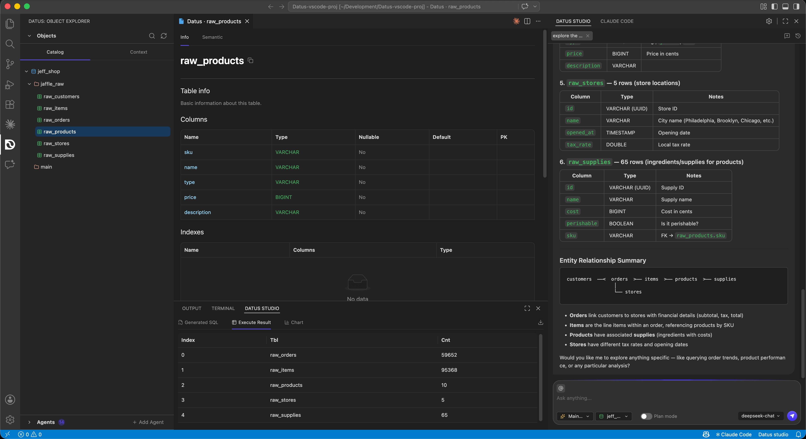
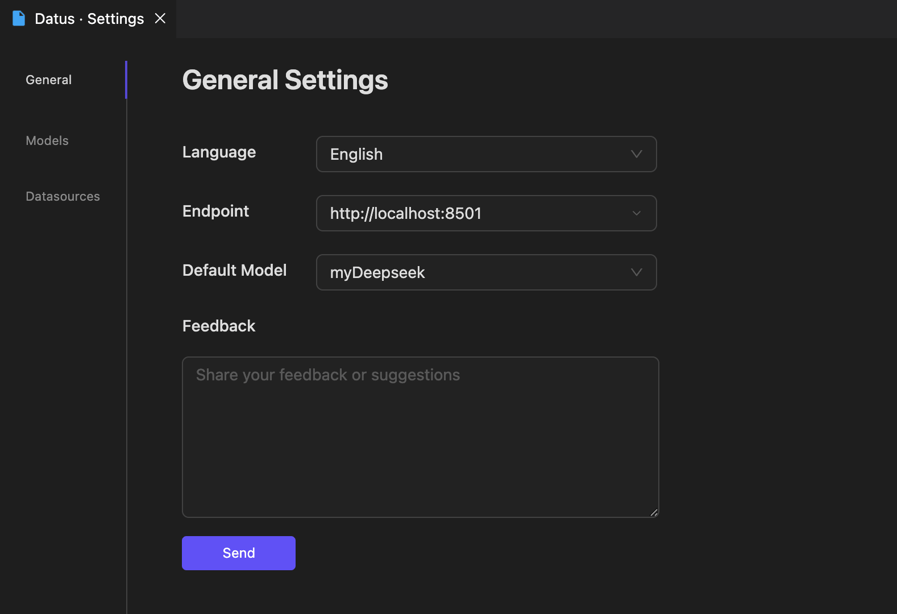
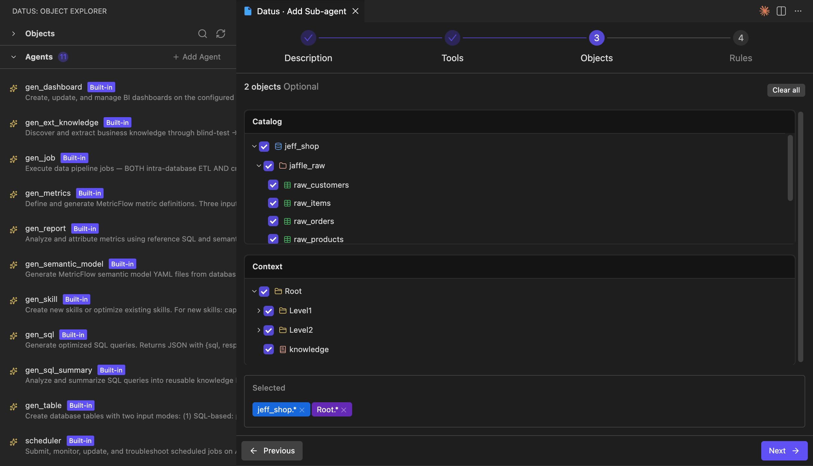
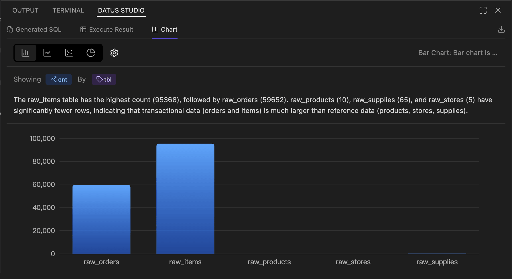

# VSCode Extension User Guide

## Overview

**Datus Studio** is the official VSCode extension for Datus-agent. It brings Datus's data engineering capabilities directly into the IDE you use every day. The extension reuses the Datus-agent Web Server (HTTP service) and connects to the backend through a single Endpoint, so all metadata, subagents, context, models, and datasource configurations come from the same Datus instance.

Target scenarios:

- **Data engineers / analysts**: handle natural-language Q&A, SQL generation, and result visualization in the same window where you write code and tune SQL — no more bouncing between IDE / browser / terminal.
- **AI-native data development**: Object Catalog, Context (Metrics / Reference / Knowledge), SubAgent, Chat, SQL Result, and AI Chart are organized into native VSCode panels and follow IDE workflow conventions.
- **Multi-datasource collaboration**: connect multiple databases under one project and switch SubAgent / Datasource / Plan mode without leaving the editor.



## Installation

The current release channel is direct VSIX install:

1. Download the latest build: [https://cdn.studio.datus.ai/vsc/release/datus-studio-vsix.zip](https://cdn.studio.datus.ai/vsc/release/datus-studio-vsix.zip), Unzip the zip file to get the .vsix file.
2. In VSCode, open the command palette (`Cmd/Ctrl + Shift + P`) and run **Extensions: Install from VSIX...**, then pick the file you just downloaded.
3. After installation, a Datus Studio icon appears in the Activity Bar, along with three new panels: **Datus: Object Explorer** on the left, the main **Datus Studio** (Chat) panel (You can drag it to the right manually), and the bottom **Datus Studio** panel (SQL / Chart).

!!! tip "Upgrading"
    Re-download latest `.vsix` file and run *Install from VSIX* again to overwrite the existing installation.

## Launch Steps

Datus Studio itself does not hold any model or database credentials — every capability is served by the Datus-agent Web Server. Launch in the following order.

### 1. Start Datus-agent with the Web Server

Any launch command that includes `--web` works; the key is to expose the HTTP service. Common variants:

```bash
# Specify a datasource directly
datus-cli --web --datasource <your_datasource>

# Use a config file + datasource (recommended for project-scoped setups)
datus-cli --web --config /path/to/conf/agent.yml --datasource <your_datasource>

# Custom port and bind address
datus-cli --web --port 8080 --host 0.0.0.0
```

After startup, the terminal prints the actual service URL, for example:

```text
http://localhost:8501
```

Note this URL — you will plug it into the extension's Settings in the next step.

!!! note "Why `--web` is required"
    The VSCode extension talks to Datus-agent over HTTP. CLI mode (without `--web`) only runs inside the terminal and exposes no HTTP port, so the extension has nothing to connect to.

### 2. Configure the Endpoint in VSCode

1. Open **Datus Studio** chat panel in the Activity Bar and click the gear icon in the top-right corner to open **Datus · Settings**.
2. Switch to the **General** tab and paste the URL from the previous step into **Endpoint**, e.g. `http://localhost:8501`.
3. The same page also exposes:
    - **Language**: extension UI language (Chinese / English).
    - **Default Model**: the LLM used by default in chat; the dropdown is populated from the providers configured in Datus-agent.
    - **Feedback**: send feedback or suggestions directly to the Datus team.



After saving, the extension reloads automatically and connects to Datus-agent. The Object Explorer on the left immediately fetches the database catalog and registered subagents.

!!! tip "Models / Datasources sub-pages"
    The **Models** and **Datasources** sub-pages are visual mirrors of the same configuration in Datus-agent. You can edit them directly from the extension and the changes are written back to the corresponding `agent.yml`.

## Core Features

The extension is laid out in three regions following standard VSCode conventions: **Catalog Tree / Context Tree / SubAgent Explorer on the left**, **Datus Studio Chat on the right**, and **Datus Studio (SQL / Chart) at the bottom**.

### 1. Catalog Tree and Context Tree

The left-hand **Datus: Object Explorer** offers two tabs:

- **Catalog**: a `database → schema → table` tree for the active datasource, sourced from the metadata Datus-agent has scraped.
    - Click a table → a *Table Info* tab opens in the editor area with **Columns** (type / nullable / default / PK), **Indexes**, and **Sample data**.
    - Search and refresh are available at the top — refresh after metadata changes to resync immediately.
- **Context**: the context knowledge tree, aligned with Datus-agent's `subject/` directory:
    - **Metrics**: MetricFlow metric definitions.
    - **Reference**: Reference SQL and Reference Templates.
    - **Knowledge**: External Knowledge / Platform Documentation.

Any node in Catalog or Context can be referenced from Chat (use `@` in the chat input to pick one), and can also serve as the visible scope of a SubAgent (see below).

### 2. Creating and Managing SubAgents

The **Agents** section in the lower-left lists every subagent for the current project (both built-in and custom). Click **+ Add Agent** to enter a four-step wizard:

1. **Description**: basic information (name, description, target scenario).
2. **Tools**: pick available tools / MCP tools.
3. **Objects**: define the SubAgent's visible **Catalog scope** and **Context scope** — using the same two trees as above, with check boxes down to schema / table / knowledge-node level. The *Selected* area at the bottom echoes wildcards such as `jeff_shop.*` and `Root.*`.
4. **Rules**: behavior rules, few-shot examples, conversational style, and so on.



Submitting the wizard writes the subagent into Datus-agent's configuration (equivalent to `/agent` in the CLI) and immediately makes it selectable from the SubAgent dropdown in the Chat panel. Built-in subagents (`gen_sql`, `gen_metrics`, `gen_dashboard`, `gen_semantic_model`, `gen_report`, `scheduler`, …) are read-only — you can inspect their Tools / Objects / Rules in the wizard but cannot edit them.

### 3. Datus Studio Chat Panel

The right-hand **Datus Studio** is the main entry point for talking to Datus-agent. It mirrors Web Chatbot but stays closer to IDE workflow:

- **Plain conversation**: ask in natural language; Datus generates SQL, calls tools, and returns results as Markdown / tables / links.
- **SubAgent switching**: the **Main...** dropdown below the input lets you pick `gen_sql`, `gen_dashboard`, `gen_metrics`, or any custom subagent. Switching immediately routes the chat through that subagent's visible scope and rules.
- **Datasource switching**: the **database** dropdown in the bottom-right switches the current session's datasource without a restart.
- **Plan mode**: when enabled, Datus first emits an execution plan and a SQL draft, then waits for your confirmation before executing — well suited to high-risk queries on production data.
- **Session history**: chat history is stored under `~/.datus/sessions/{project}/`, partitioned by project; the side panel can load past sessions to continue chatting or to compare side-by-side.
- **Editor integration**: select SQL or text in the editor, right-click *Datus: Add Selection to Chat* (command `datus.addSelectionToChat`), and the selection is dropped into the chat as context.

### 4. SQL Result and AI Chart Panel

After SQL is executed (whether generated by chat, hand-written, or returned by a SubAgent), the result lands in the bottom **Datus Studio** panel with three sub-tabs:

- **Generated SQL**: the full SQL produced / executed in this turn, with copy and one-click write-back to the editor.
- **Execute Result**: paginated grid with sortable columns, resizable widths, and CSV / Excel download.
- **Chart**: a visualization area powered by [ECharts](https://echarts.apache.org/).

The Chart sub-tab provides:

- **Chart-type switching**: bar / line / scatter / pie.
- **Dimension / measure binding**: pick fields via *Showing `<measure>` By `<dimension>`*; the gear icon exposes axis, color, and stacking options.
- **AI commentary**: a trend / anomaly / comparison narrative is generated by the LLM and shown above the chart.
- **Export**: the download icon in the top-right exports PNG / data.



### 5. FileSystem Tools (file-operation interception)

During natural-language conversations and subagent execution, Datus-agent calls a set of file tools (`read_file` / `write_file` / `edit_file` / `glob` / `grep`) to read and write local files and to search code and configuration. **In the VSCode scenario, these file tools are intercepted by the extension**: file operations never land in the directory where the Datus-agent process happens to be running — they are uniformly applied to the **workspace folder currently open in VSCode** (`workspaceFolders[0]`).

- **Unified root directory**: regardless of which machine Datus-agent runs on or which working directory it was launched from, file reads and writes always happen inside the project you see in VSCode. No more "the SQL was written but the file is nowhere to be found" disconnects.
- **Enforced path sandbox**: every incoming path is checked to ensure its prefix lies inside the workspace. Any attempt to escape the workspace (e.g. `../../etc/passwd`) is rejected with `Invalid path`.
- **Allow-list + size limit**: only text-style extensions are accepted (`.txt` `.md` `.py` `.js` `.ts` `.json` `.yaml` `.yml` `.csv` `.sql` `.html` `.css` `.xml`, …); per-file read cap is **10 MB**, `grep` skips files larger than 1 MB, and both `glob` and `grep` automatically ignore `.git/` and `node_modules/`.

#### Recommendations

- **Keep the VSCode workspace clean**: because reads and writes are anchored to the workspace root, map each Datus project to its own VSCode workspace folder, lined up with Datus-agent's `project_name` and `subject/` directory. Files generated by subagents (`metric.yml`, `semantic_model.yml`, `reference_sql/*.sql`, …) then land in the right place.
- **No folder open**: when no workspace is open in VSCode, the file tools all return errors. Open your project via *File → Open Folder...* before starting a conversation.
- **Files outside the allow-list**: binary files, notebooks, Office documents, etc. are rejected outright. Convert them to a supported text format first, or extend the allow-list by modifying the extension source.

## FAQ

### The extension keeps showing "Disconnected"
Double-check the Endpoint, make sure Datus-agent was started with `--web`, and verify firewall rules on remote hosts.

### The port is already in use
After running `datus --web --port 8080 ...`, update Settings → Endpoint to `http://localhost:8080` to match.

### The Catalog has no tables
Make sure Datus-agent has run metadata ingestion against the datasource (`/init` or `/refresh-meta` in the CLI). The extension only renders what the backend returns.

### Can I edit built-in subagents?
No. Built-in subagents are read-only. To customize behavior, use *+ Add Agent* to create a new standalone subagent.

## Summary

The Datus Studio VSCode extension brings the core capabilities of Datus-agent — metadata browsing, context management, subagent orchestration, chat, SQL execution, and AI visualization — into a single in-IDE workspace. It shares the same backend configuration and knowledge base with the [CLI](../cli/introduction.md) and the [Web Chatbot](../web_chatbot/introduction.md), making it the smoothest entry point for development workflows.
